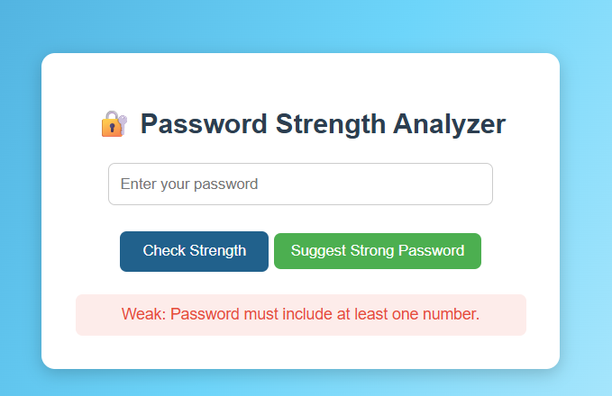
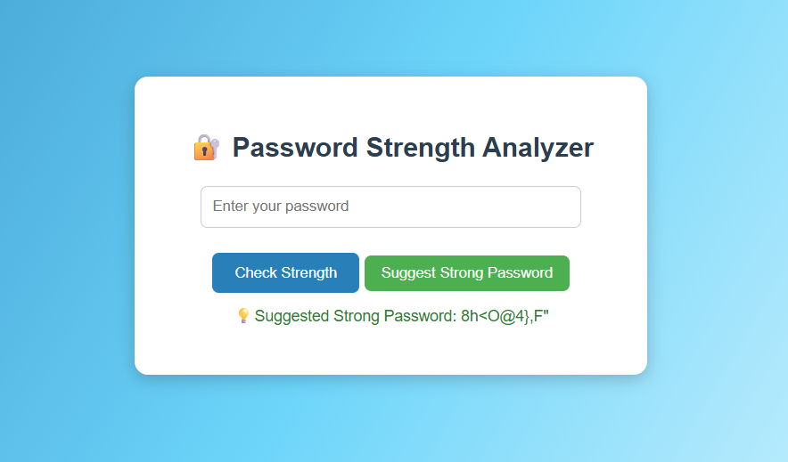
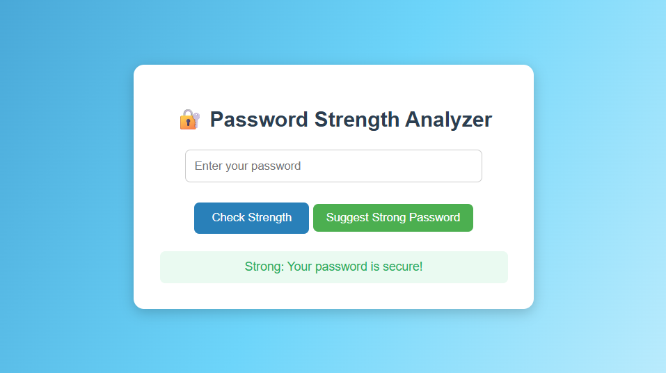
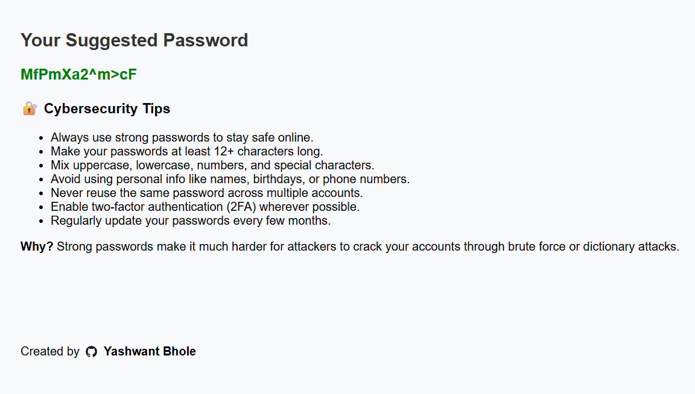

# 🔐 Password Strength Analyzer

A beginner-friendly cybersecurity web application that analyzes the strength of a password, provides real-time feedback, suggests a secure random password, and even allows you to download the suggested password as a styled .html file with cybersecurity tips. 

Built with **Python (Flask)**, **HTML/CSS**, and **JavaScript** for a clean, interactive interface.  

---

## 🌟 Features

- ✅ Checks password for:
  - Minimum 8 characters  
  - At least one uppercase letter  
  - At least one lowercase letter  
  - At least one number  
  - Special characters  

- ✅ Provides **Weak / Medium / Strong** feedback  
- ✅ Automatically hides results after **5 seconds**  
- ✅ **Suggest Strong Password button** to generate a random secure password  
- ✅ **Download Suggested Password** as a styled .html file with tips & GitHub credit
- ✅ Fully responsive and **professional UI**  

---
## 🌐 Live Demo
[Click here to try the Password Strength Analyzer](https://password-strength-analyzer-8243.onrender.com/)

---
## 🖥️ Demo Screenshots

**1️⃣ Password Strength Weak**  


**2️⃣ Strong Password Suggestion**  


**3️⃣ Password Strength Strong**  


**4️⃣ Suggested HTML file**  


---

## 🛠️ Technologies Used

- **Backend:** Python, Flask  
- **Frontend:** HTML5, CSS3, JavaScript  
- **Libraries:** `re` (regex for password validation), `secrets` & `string` (for password generation)  
- **Optional Styling:** TailwindCSS / Bootstrap  

---

## ⚙️ How It Works

1. User enters a password in the input field.  
2. Flask backend validates password against multiple criteria.  
3. Returns a result message: **Weak / Medium / Strong**.  
4. JavaScript automatically hides the message after **5 seconds**.  
5. User can click **“Suggest Strong Password”** to instantly generate a random secure password.  

---

## 🚀 Getting Started

### 1. Clone the repository
 ```bash
1. git clone https://github.com/your-username/password-strength-analyzer.git
cd password-strength-analyzer

2. Install dependencies
pip install flask

3. Run the application
python app.py

4. Open in browser

Visit http://127.0.0.1:5000
```
 
 ## 👨‍💻 Connect with Me  

<p align="center">  
  <a href="https://www.linkedin.com/in/yashwantbhole/" target="_blank">
    
  </a>
  <a href="mailto:yashwantbhole2004@gmail.com">
    
  </a>
  <a href="https://github.com/YashwantBhole" target="_blank">
    
  </a>
  <a href="https://www.instagram.com/yashwant_bhole_07" target="_blank">
    
  </a>
</p>
